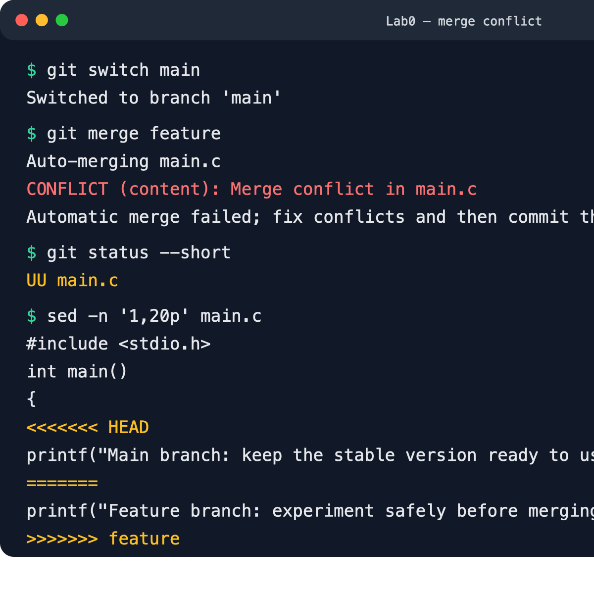
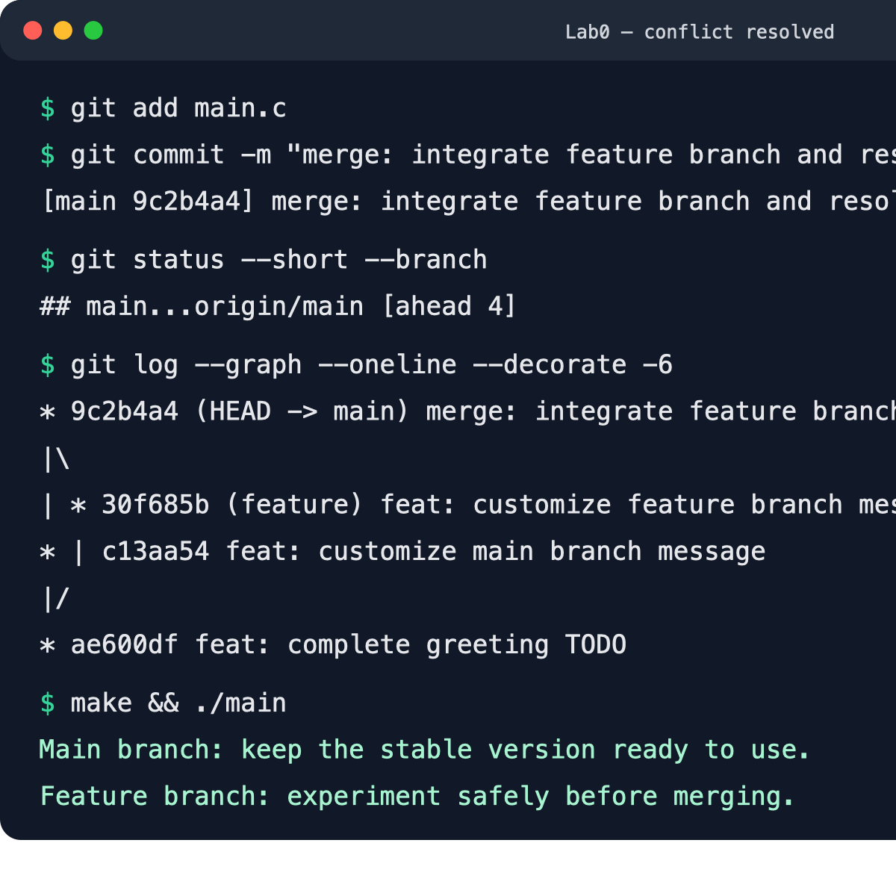

# Lab0 Git 实验报告

仓库：`RuoyiXu/GitLab`

## 一、思考题

### 1. 多人协同开发经历

我之前有过在小组作业中分工协作的经历。组员会先约定各自负责的部分，再通过共享文件或 Git 仓库汇总成果。相比直接互相发送多个版本的文件，Git 能明确记录每个人做了什么，也方便在出现问题时找到对应改动。

### 2. Git 为什么设计“暂存—提交”两个步骤？

工作区中的修改不一定都属于同一个目的。暂存区允许我先从所有修改中挑出准备纳入本次提交的内容，检查无误后再形成一次提交。这样可以把混在一起的修改拆成逻辑清楚、容易审查和回退的提交，也能避免把临时调试内容误交进去。

### 3. `git branch` 和 `git branch -a` 的区别

- `git branch` 默认只列出本地分支，并用 `*` 标出当前分支。
- `git branch -a` 会同时列出本地分支和远程跟踪分支，例如 `remotes/origin/main`。

因此，想检查自己本地有哪些分支时使用 `git branch`；想同时了解远程仓库中已知的分支时使用 `git branch -a`。

## 二、扩展阅读

### 1. Commit Message 规范

文章介绍了结构化提交信息的作用和写法。规范的提交信息通常采用 `type(scope): subject` 形式，其中 `type` 可以是 `feat`、`fix`、`docs` 等。清楚的提交信息便于浏览和筛选历史，还可以自动生成 Change Log。本实验中的提交信息也采用了类似形式，例如 `feat: complete greeting TODO`。

### 2. 语义化版本

语义化版本使用 `主版本号.次版本号.修订号` 的格式。修复兼容问题时增加修订号，新增向后兼容功能时增加次版本号，出现不兼容改动时增加主版本号。它让版本号不仅是编号，还能表达改动的影响范围，帮助使用者判断升级风险和依赖关系。

### 3. 为什么要学习 Git

Git 不只是备份工具。它能记录项目演化过程、支持并行开发、帮助定位错误，并让合并与回退都有依据。个人开发时，提交历史可以保存阶段性成果；团队开发时，分支和合并机制可以减少互相覆盖代码的问题。规范的提交记录还能让代码审查和后续维护更高效。

## 三、实验步骤

1. 在课程模板仓库中点击 **Use this template → Create a new repository**，创建个人仓库，没有使用 Fork。
2. 克隆个人仓库，并确认 `.github/workflows/classroom.yml` 已随模板保留且未修改。
3. 修改 `main.c` 中的 TODO，提交为 `feat: complete greeting TODO`。
4. 创建 `feature` 分支，在该分支修改同一行输出并提交。
5. 返回 `main` 分支，对同一行进行另一种修改并提交。
6. 执行 `git merge feature`。由于两个分支修改了同一文件的同一行，Git 无法自动判断应该保留哪一版，因此产生内容冲突。
7. 手动删除冲突标记并保留两条有意义的输出，执行 `git add main.c`，再提交合并结果。
8. 执行 `make` 和 `./main` 验证程序可以编译运行，最后推送到 GitHub。

## 四、合并冲突记录

### 1. 出现冲突

下图显示执行 `git merge feature` 后，终端报告 `CONFLICT (content)`，`git status --short` 显示 `UU main.c`，文件中也出现了冲突标记。

### 2. 解决冲突

我检查了两个分支的修改，删除 `<<<<<<<`、`=======`、`>>>>>>>` 标记，保留了两条输出语句，并提交合并结果。下图中的分支图表明 `main` 和 `feature` 已完成合并，程序也成功编译运行。

## 五、实验结果

- `main.c` 已完成修改，不再输出模板原始的 `Hello, world!`。
- `feature` 和 `main` 分支都包含独立提交。
- 合并时确实产生了冲突，并已人工解决。
- `make` 编译无报错，程序能正常运行。
- 自动评分 workflow 保持模板原样。

## 六、建议

建议后续实验继续保留这种“先制造问题、再观察并解决”的练习方式。亲自处理一次冲突，比只阅读命令更容易理解 Git 的工作流程。
